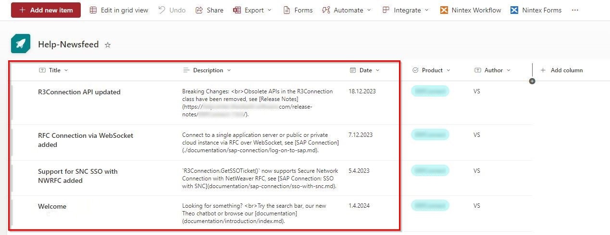
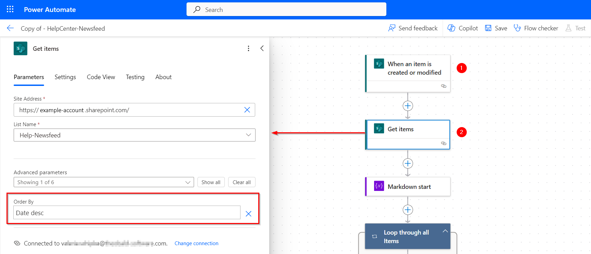
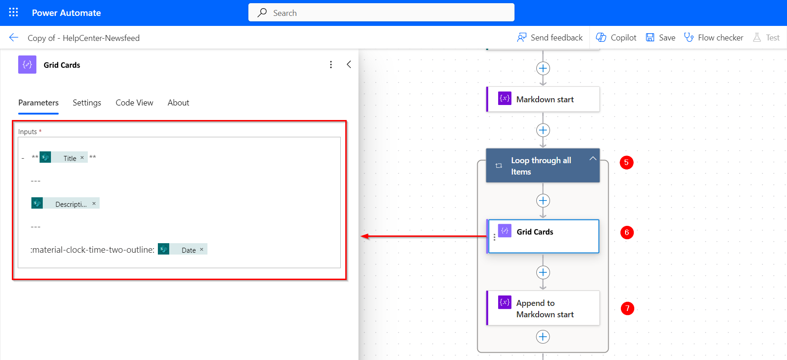
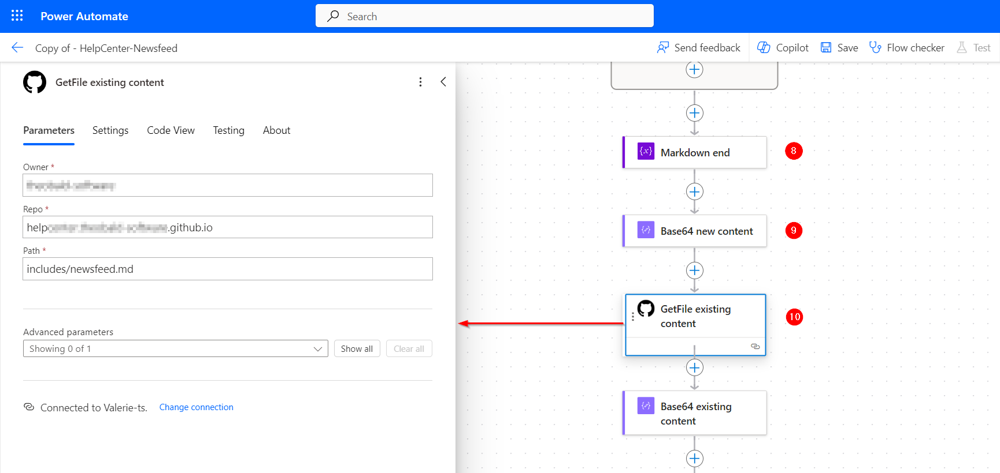

In this post I'd like to show you how to use [Microsoft Power Automate](https://www.microsoft.com/en-us/power-platform/products/power-automate) to generate markdown content for your MkDocs project.<br>
Power Automate is a cloud-based process automation service that can be used to create automated workflows to synchronize and collect data, get notifications, start approvals, and more. 

### About this Use Case

There are multiple reasons to automate content creation.
In our case, we wanted to make it easier for non-developers to publish news in the "Latest News" section of our [HelpCenter](https://helpcenter.theobald-software.com/erpconnect/), see screenshot below.
<!--


---


-->

Because our marketing and support teams are not familiar with gitHub and/or MkDocs, we wanted to give them the opportunity to directly publish content using a [SharePoint Online](https://www.microsoft.com/en-us/microsoft-365/sharepoint/collaboration) list.
Whenever someone adds an item to the SharePoint list or edits an existing item, a Power Automate workflow is triggered that writes the content of the list to a markdown file and publishes the file to gitHub.


### Prerequisites

- Create an empty markdown file for your generated content in your MkDocs project (e.g., newsfeed.md).
- Create a Microsoft SharePoint list with all needed input columns (here title, description and date).<br>

- Follow the steps described in Jan Vidar Elven's [How to Send Requests to GitHub API from Power Platform using Custom Connector](https://gotoguy.blog/2021/01/20/how-to-send-requests-to-github-api-from-power-platform-using-custom-connector/) to create an OAuth Application for the Github API and create a Power Automate Custom Connector for the OAuth Application.
<!--- Create a new Power Automate worklow that is triggered when the SharePoint list is modified.-->


The depicted example uses markdown syntax that is specific to the [Material](https://squidfunk.github.io/mkdocs-material/) theme to create [grid cards](https://squidfunk.github.io/mkdocs-material/reference/grids/) for the SharePoint items. When using a different theme, make sure to adjust the depicted markdown code accordingly.


### Workflow

Add the following actions to your Power Automate workflow:
1. Create a new Power Automate worklow.
2. Add a trigger that runs the workflow whenever your SharePoint list is modified.
3. Read out all items of the SharePoint list. During this step we also sort the items based on the *Date* column of the SharePoint list.

4. Add an **Initialize variable** action to create a new string variable for the new markdown content (3). To create [grid cards](https://squidfunk.github.io/mkdocs-material/reference/grids/#list-syntax), enter the following string as the initial value of the variable:

    ```
    <div class="grid cards" markdown>
    ```
    
5. Add a **For each** action to loop through all items in the SharePoint.
6. Add a **Compose** action to create the new markdown content based on the content of the SharePoint list, e.g., `items('name_of_the_for_each_action')?['column_name']`. <br>
The depicted example uses the following string to create a grid card using the *Title*, *Description* and *Date* columns of the current SharePoint item:

    ```

    -   **items('Loop_through_all_Items')?['Title']**

        ---

        items('Loop_through_all_Items')?['Description']

        ---

        :material-clock-time-two-outline: items('Loop_through_all_Items')?['Date']
    ```
    
7. Add an **Append to string variable** action to append the output of the composed string to the initial string variable created in step 4. 
8. Add another **Append to string variable** action after the loop to add additional markdown content to the end the markdown file. The following string is added to close the list of grid card items:

    ```
    
    </div>
    ```
9. Add a **Compose** action to parse the content of your string variable to the Base64 format used by gitHub, e.g., `base64(variables('variable-name'))`.
10. Add the gitHub Custom Connector described in Jan Vidar Elven's [How to Send Requests to GitHub API from Power Platform using Custom Connector](https://gotoguy.blog/2021/01/20/how-to-send-requests-to-github-api-from-power-platform-using-custom-connector/) to read the content of the target markdown file in your gitHub repository. This is necessary to get the SHA value of the markdown file that is required to write the new content to the file.

11. Optional: Implement logic to check if the file exists, what to do in case the file is not accessible, etc. <br>
Here, we format the content of the existing markdown file from Base64 to string (`base64ToString(outputs('name_of_custom_connector')?['body/content'])`) and compare the new content with the existing content to see if the file needs to be updated or not (this has to do with the additional SharePoint columns that are not covered in this post).
12. Add the gitHub Custom Connector to overwrite the target markdown file with the new formatted content from step 9.

13. Optional: Add an email notification to get informed, whenever a new item is successfully published to GitHub.

The final newsfeed.md file looks like this:

```
<div class="grid cards" markdown>


-   **Welcome to the ERPConnect HelpCenter**

    ---

    Looking for something? <br>Try the search bar, our new Theo chatbot or browse our [documentation](documentation/introduction/index.md).

    ---

    :material-clock-time-two-outline: 2024-04-01

-   **R3Connection API updated**

    ---

    Breaking Changes: <br>Obsolete APIs in the R3Connection class have been removed, see [Release Notes](https://helpcenter.theobald-software.com/release-notes/ERPConnect-7.6.0/).

    ---

    :material-clock-time-two-outline: 2023-12-18

-   **RFC Connection via WebSocket added**

    ---

    Connect to a single application server or public or private cloud instance via RFC over WebSocket, see [SAP Connection](./documentation/sap-connection/log-on-to-sap.md). 

    ---

    :material-clock-time-two-outline: 2023-12-07

-   **Support for SNC SSO with NWRFC added**

    ---

    `R3Connection.GetSSOTicket()` now supports Secure Network Connection with NetWeaver RFC, see [SAP Connection: SSO with SNC](documentation/sap-connection/sso-with-snc.md).

    ---

    :material-clock-time-two-outline: 2023-04-05

</div>
```

### How to use the Generated File

You can use the generated markdown file as a single page dedicated news or you can include the content of the file on other pages.

The "Latest News" section on our landing page only shows the first 3 items of the SharePoint list by using the [PyMdown Extension: Snippet Lines](https://facelessuser.github.io/pymdown-extensions/extensions/snippets/#snippet-lines). Additionally we provide a "show more" link that opens the complete newsfeed page: 


You can use the following markdown code to recreate the "Latest News" section (note that for this to work, at least 3 items must be available in the SharePoint list):

``` markdown
### Latest News

<div class="grid cards" markdown>

<!--- Inject content between line 3 and line 33 of newsfeed.md ~ first 3 grid cards -->
--8<-- "newsfeed.md:3:33" 

</div>

[:octicons-arrow-right-24: Show more](newsfeed.md)
```
<br>
Aaand that's it! 

I hope this was helpful and could inspire someone to do other cool things with Power Automate and MkDocs :smile:.