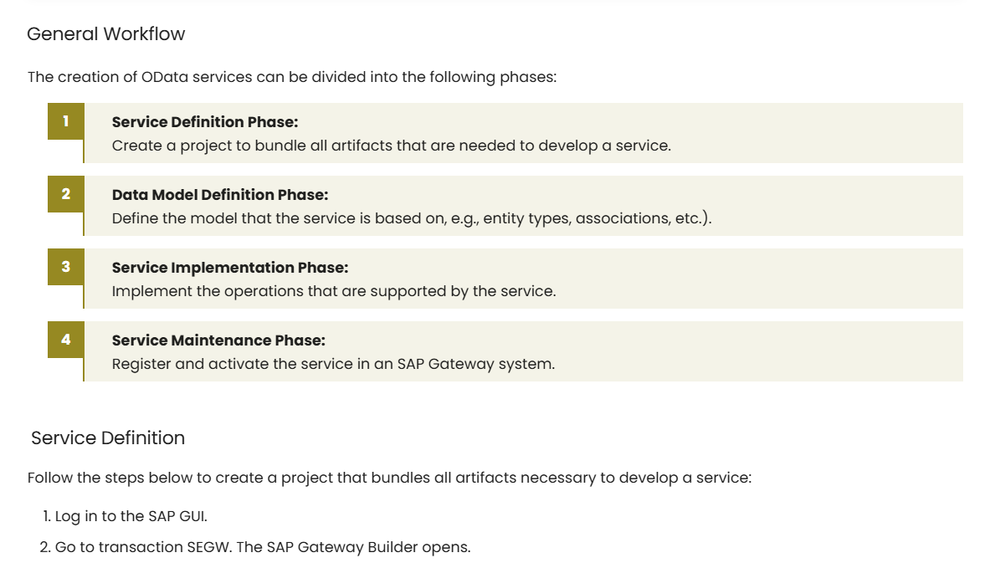

So, today I want to talk a little bit about ordered lists in MkDocs and the [Material theme](https://squidfunk.github.io/mkdocs-material/).

Recently, I felt the need to include some linear workflows in a few Knowledge Base articles. Most of these Knowledge Base articles contain How-To's that involve tasks with a lot of steps or tasks that need to be performed in a 3rd-party software. For situations like this I like to group the steps into more digestible subtasks and list them as a "general workflow" before getting into the details.
This has the advantage that users who already have knowledge on how to do certain things, e.g., in 3rd-party-software, can skip subtasks and get done faster.

At first, I first tried to use flowcharts for these linear workflows, but this seemed a bit over-the-top for what is essentially just an ordered list.
That said, I still wanted to visually differentiate between ordered lists that represent workflows and ordered lists that represent step-by-step instructions.
So in the end, I decided on a custom styling specifically for workflow lists. This is how it turned out:



## Custom CSS

To add the custom list styling for workflows to your project, add the following css definitions to your [extra.css stylesheet](https://squidfunk.github.io/mkdocs-material/customization/?h=custom#additional-css): 

```css
/* Target ordered lists inside workflow containers */
.md-typeset .workflow ol {
    counter-reset: workflow-counter;
    list-style: none;
    padding-left: 0;
    position: relative;
}

/* Style each list item */
.md-typeset .workflow ol > li {
    counter-increment: workflow-counter;
    position: relative;
    padding: 0.4rem 0.4rem 0.3rem 1.5rem; /* Space for numbering */
    margin-bottom: 0.7rem; /* Space between steps */
    background: rgba(152, 137, 44, 0.1); /* Light background */
    border-radius: 0px;
    border-left: 2px solid #98892C; /* Left border */
    margin-left: 2.5rem; /* Shift the entire text box to the right */
}

/* Custom step number */
.md-typeset .workflow ol > li::before {
    content: counter(workflow-counter);
    position: absolute;
    left: -2.0rem; /* Keep the number at the start */
    top: 1.0rem;
    transform: translateY(-50%);
    width: 2rem;
    height: 2rem;
    background-color: #98892C; /* Step color */
    color: white;
    font-weight: bold;
    display: flex;
    align-items: center;
    justify-content: center;
    border-radius: 0%;
    z-index: 3; /* Ensures number is on top */
}

/* Remove the line from the last item */
.md-typeset .workflow ol > li:last-child::after {
    display: none;
}

/* Ensure nested lists remain as bullet points */
.md-typeset .workflow ol > li ul {
    list-style: disc;
    padding-left: 1.2rem;
}
```

Feel free to change the color of the light background, the left border and the step color ;)


To change the styling of all ordered lists in your project, simply remove `.workflow` from the css definitions.



## How to Use

Whenever you want to use the custom styling for a list, refer to the css class in a `<div>` element that contains the markdown list. Example:

```markdown
<div class="workflow" markdown>

1. Item 1.
2. Item 2.
3. Item 3.
    - Sub Item 1.
    - Sub Item 2.
4. Item 4.

</div>
```


You can still use regular markdown sytax in those lists to format text, link to other sections, etc.


