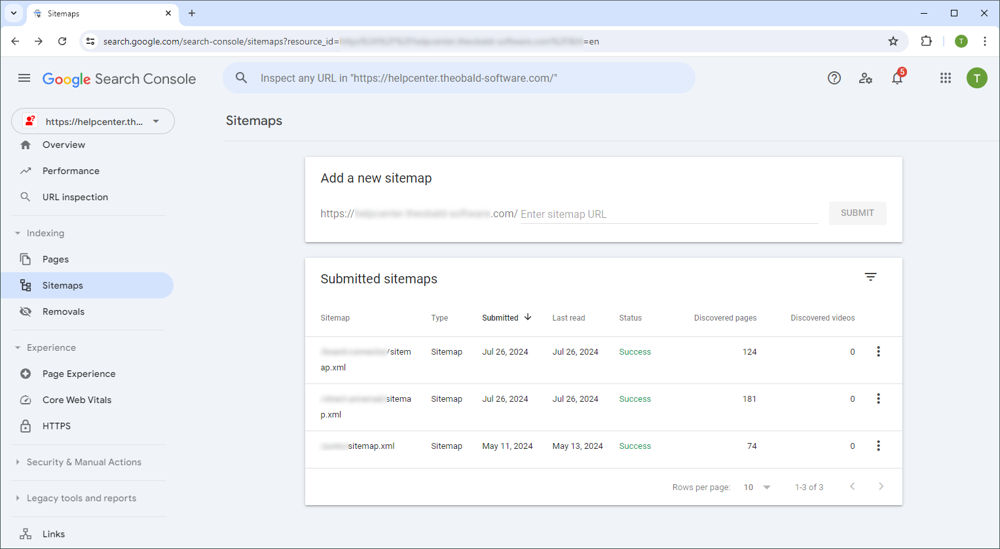

In this post I'd like to show you how to use the [Google Search Console](https://search.google.com/search-console/welcome) to index your website.

The Google Search Console offers tools and reports to help you measure your site's search traffic and performance, fix issues, and improve Google Search results. For a website to show up in a search engines (e.g. Google, Bing, etc.), the website needs to be indexed by the search engine. This can take between a few days, weeks to even months if indexing is not explicitly requested using the Google Search Console.

### Check if Your Website is Indexed

Open your search engine and type in the URL search bar: “*site:your-domain-name.com*".
This displays a list of all pages from the specified website that have been indexed by the search engine.
 

### Set up Google Search Console

To use the Google Search Console for your website, you need to [verify ownership the site](https://support.google.com/webmasters/answer/9008080). There are multiple ways to do so. The depicted approach uses the [**HTML file**](https://support.google.com/webmasters/answer/9008080#html_verification) method. This approach requires uploading a file and might not work on a site hosting platform.

1. Open the Google Search Console website https://search.google.com/ in your browser.
2. Select the property type **URL prefix**. <br> 
3. Enter the URL of your website and click **CONTINUE**. The menu "Verify ownership" opens.
4. Download the google html file and upload it to the root directory of your website. The file must be publicly available in your URL.
5. Once the file is uploaded, click **VERIFY** to verify the site ownership. 
6. If the verification is successful, click **GO TO PROPERTY** to open the Google Search Console. <br> 

To integrate the Google Search Console with Google Analytics, refer to [[GA4] Search Console integration](https://support.google.com/analytics/answer/10737381?hl=en).


### Request Indexing

Depending on the search engine, there are different ways and tools of requesting indexing for your website:

- [Bing Webmasters Tools](https://www.bing.com/webmasters/about)
- [Google Search Console](https://search.google.com/search-console/welcome)

The following section focuses on using the Google Search Console.

1. In the Google Search Console, open the **URL Inspection** menu.
2. Enter the URL to your Website in the *Inspect any URL* search bar.
3. Click **TEST LIVE URL**. If the website is not yet indexed, the Google Search Console checks if the URL can be indexed or if there are issues that need to be fixed first.
4. Click **REQUEST INDEXING**. <br>
5. Recommended: Open the **Sitemaps** menu and submit [sitemaps](https://developers.google.com/search/docs/crawling-indexing/sitemaps/overview) of your website. A sitemap is a file that provides information about the pages, videos, and other files on your site. Search engines like Google read this file to crawl your site more efficiently.<br>
6. Wait and check if your website is indexed. <br>


### Exclude Pages from Search Engines

It may be necesarry to exclude multiple or single pages from showing up in search engines. In this case, you can use a robots.txt file in your website to define which content should be excluded from being crawled by search engines.

Example:

```
User-agent: *
Disallow: /folder/*
```

Important rules:
- The file must be named *robots.txt*.
- Your site can have only one robots.txt file.
- The robots.txt file must be located at the root of the site host to which it applies. For instance, to control crawling on all URLs below `https://www.example.com/`, the robots.txt file must be located at `https://www.example.com/robots.txt`. 
- A robots.txt file must be an UTF-8 encoded text file (which includes ASCII). Google may ignore characters that are not part of the UTF-8 range, potentially rendering robots.txt rules invalid.

For more information on robots.txt files, refer to the [Google Search Console Documentation](https://developers.google.com/search/docs/crawling-indexing/robots/create-robots-txt).