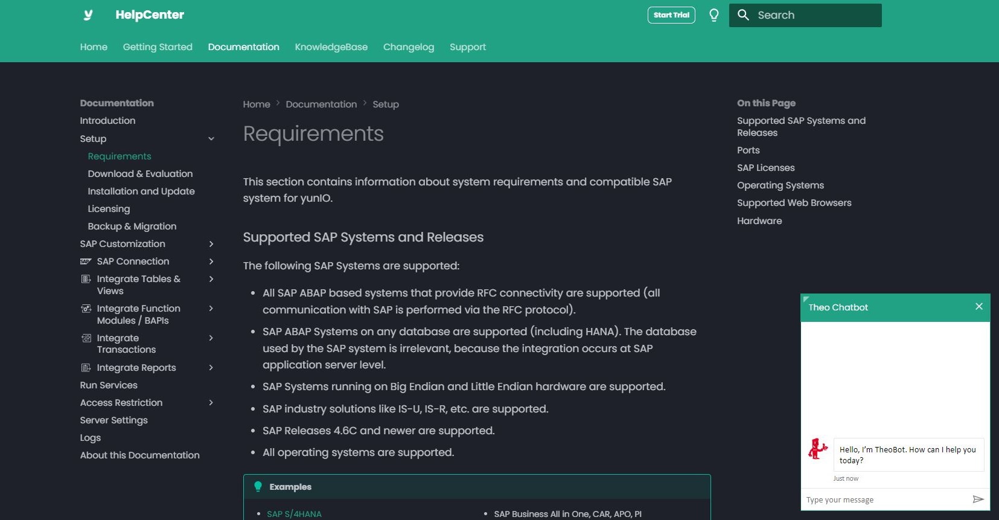
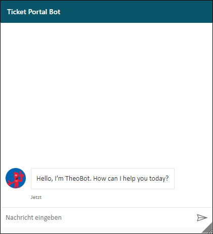
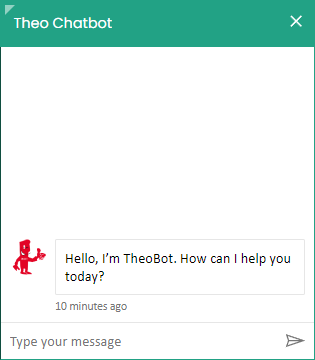
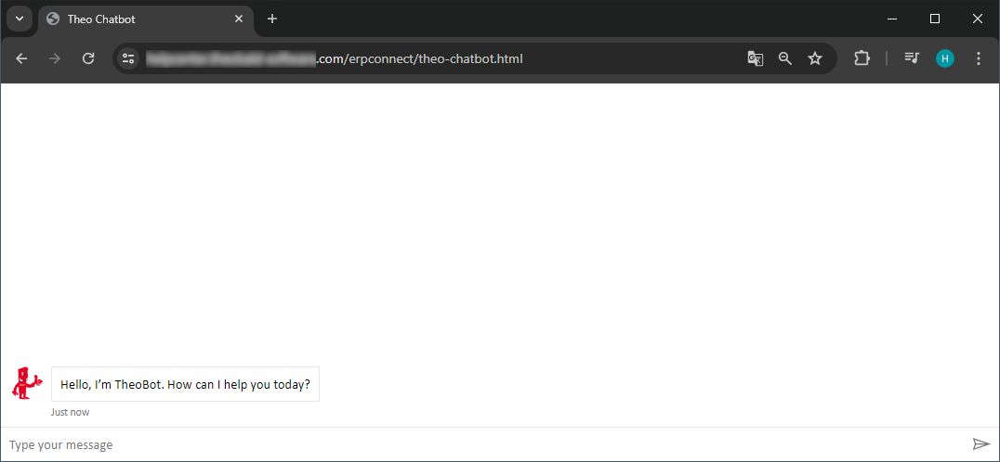
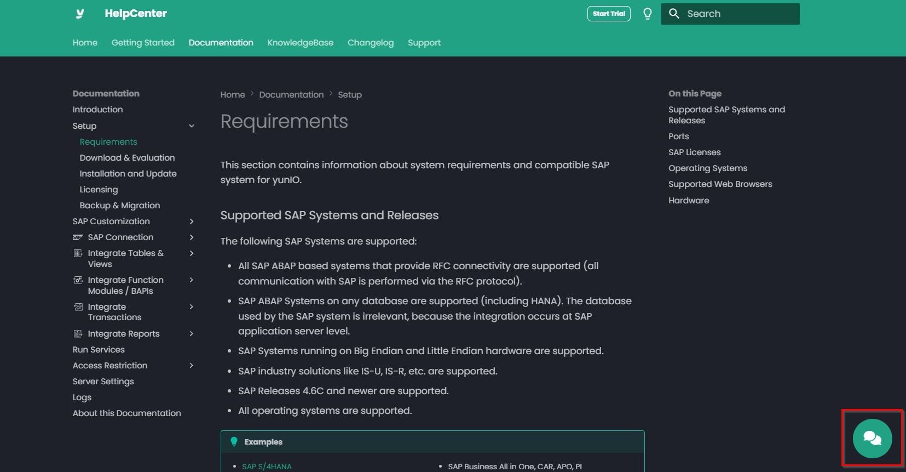

In this post I'd like to show you how to integrate a custom [Microsoft Copilot Studio Chatbot](https://www.microsoft.com/en-us/microsoft-copilot/microsoft-copilot-studio) with MkDocs. The goal is to provide a chatbot on all pages of the documentation, that is trained with the content of the documentation, see screenshot.




### About this Approach

You can connect to a copilot with a custom canvas that is hosted as a standalone web app in your MkDocs project.
This option is best if you need to embed a customized iFrame across multiple web pages / documentation pages.
Note that the depicted example uses the [Material](https://squidfunk.github.io/mkdocs-material/) theme and integrates the chatbot by extending the theme.

This post also covers the following customizations to the chatbot`s look and feel:

- change the text displayed in the banner
- change the color of the banner
- add a close button to the banner
- add a scaler to the banner (upper left corner) to resize the chatbot
- add a button to open the chatbot on multiple documentation pages


Default Chatbot:


---
Customized Chatbot:


---




### Setup in Copilot Studio

1. Create a new Copilot chatbot in Copilot Studio, see [Microsoft Documentation: Create and Deploy a Copilot Studio Copilot](https://learn.microsoft.com/en-us/microsoft-copilot-studio/fundamentals-get-started?tabs=web).
2. Train the Copilot with your published MkDocs website. Note that there are requirements for some URLs, see [Microsoft Documentation: URL type and structure](https://learn.microsoft.com/en-us/microsoft-copilot-studio/nlu-boost-conversations?wt.mc_id=power-virtual-agents_inproduct#url-considerations).
3. Optional: Customize Icons, answers, etc, see [Microsoft Documentation: Change the copilot name and icon](https://learn.microsoft.com/en-us/microsoft-copilot-studio/customize-default-canvas?tabs=web#change-the-copilot-name-and-icon).
4. Thoroughly test your chatbot in Copilot Studio.
5. Publish the chatbot, see [Microsoft Documentation: Publish your Copilot](https://learn.microsoft.com/en-us/microsoft-copilot-studio/fundamentals-get-started?tabs=web#publish-your-copilot---web-app).
6. Copy the token endpoint of your chatbot, see [Microsoft Documentation: Retrieve token endpoint](https://learn.microsoft.com/en-us/microsoft-copilot-studio/customize-default-canvas?tabs=web#retrieve-token-endpoint). The token is needed to integrate the chatbot to your website.

You can add the created chatbot as-is to your website using a simple code snippet, see [Microsoft Documentation: Add your Copilot to your Website](https://learn.microsoft.com/en-us/microsoft-copilot-studio/publication-connect-bot-to-web-channels?tabs=preview#add-your-copilot-to-your-website). To further customize the chatbot and add buttons to open and close the chatbot to your website, follow the instructions in the next paragraph.


### Integrate the Chatbot

To customize the default chatbot, we connect the copilot with a custom canvas that is hosted as a standalone web app. 

1. Copy and paste the HTML code provided by the [Microsoft Documentation: Customize the Default Canvas](https://learn.microsoft.com/en-us/microsoft-copilot-studio/customize-default-canvas?tabs=web#customize-the-default-canvas-simple) and save it as a `chatbot.html` file in the `/docs` directory of your MkDocs project.
2. Open the `chatbot.html` file and replace `<COPILOT TOKEN ENDPOINT>` with your token endpoint, see [Setup in Copilot Studio](#setup-in-copilot-studio).
    ```html
    const tokenEndpointURL = new URL('<COPILOT TOKEN ENDPOINT>');
    ```
3. Delete the following lines to remove the banner from the chatbot:

    ```html
    <div id="banner">
    <h1>Contoso copilot name</h1>
    </div>
    ```
    This removes the banner from the chatbot. We will create our own banner that includes a scaling option and a close button later.<br>
4. Test the chatbot integration (token endpoint) by serving the project. You should be able to access and interact with the chatbot via `http://localhost:8000/chatbot.html`.<br>

5. If the chatbot works as expected, publish your MkDocs project. This step is necessary to make the custom canvas accessible online. 
6. If it does not exist yet, create a folder `/overrides` in the root directory of your MkDocs project and create a file `main.html`, see [Material: Extending the Theme](https://squidfunk.github.io/mkdocs-material/customization/#extending-the-theme).

    Adding the chatbot in `main.html` makes the chatbot available on all pages of the documentation. Alternatively, create a new html template that you can assign to specific pages.
    

7. Copy and paste the following code into `main.html`:

    ``` html
    

    
    <link rel="stylesheet" href="{{ 'assets/stylesheets/chatbot.css' | url }}">
    

    
    {{ super() }}
    <script src="{{ 'assets/javascripts/chatbot.js' | url }}"></script>
    

    
    {{ super() }}

    <!-- Open Chatbot button -->
    <button class="btn-clear md-button" title="Open Chatbot" id="open_button" onclick="openChatbot()">
    <span class="twemoji" style="font-size: 35px";"><div class="fa-beat" style="margin-top: -5px;"> </div></span></button>

    <!-- Chatbot Container -->
    <div id="container" style="display: none;">
        <iframe id="chatbot_iframe" src="https://your-documentation.com/chatbot.html" frameborder="1" style="width: 100%; height: 100%;"></iframe>
        <div id="resize-handler"></div>
        <div id="banner"">
            <p style="font-family: inherit; font-size: 16px; color: white; line-height: 20px; position: absolute; left: 15px;">Theo Chatbot</p>
            <button id="close_button" onclick="closeChatbot()" title="Close Chatbot" style="position: absolute; right: 10px; color: white"><span class="twemoji" style="font-size: 20px"> </span></button> 
        </div>
    </div>
    
    ```
8. Replace the source of the chatbot iFrame (`https://your-documentation.com/chatbot.html`) with the URL of your published custom canvas.
9. Download the following files and add them to your MkDocs project:
    - <a href="chatbot.css" download>chatbot.css</a>
    - <a href="chatbot.js" download>chatbot.js</a> 
10. The depicted sample references the `chatbot.css` and `chatbot.js` files in the `main.html` file.
Depending on where you place the files in your project, you need to adjust the following lines in the `main.html` file:

    ```html
    <link rel="stylesheet" href="{{ 'assets/stylesheets/chatbot.css' | url }}">
    ```
    ```html
    <script src="{{ 'assets/javascripts/chatbot.js' | url }}"></script>
    ```
11. Serve or build the project. The button that opens the embedded custom canvas should be displayed at the bottom right corner of the screen.


### Customize the Chatbot

Alter this file to better suit your overall design.

#### Change the Text in the Banner

To change the text in the chatbot banner, modify the following lines in the `main.html` file:

```html
<p style="font-family: inherit; font-size: 16px; color: white; line-height: 20px; position: absolute; left: 15px;">Theo Chatbot</p>
``` 
#### Change Color of the Banner

To change the color of the chatbot banner, modify the following lines in the `chatbot.css` file:

```css
#banner{
	position: absolute;
	top: 0;
	left: 0;
	width: 100%;
	height: 52px;
	background-color: #ED1A33;
	align-items: center;
    display: flex;
}
```

#### Change Color of the "Close" Button

To change the color of the "Close" button in the chatbot banner, modify the following lines in the `chatbot.css` file:

```css
#close_button {
    position: absolute; 
	right: 10px; 
	color: white;
}

#close_button:hover {
	background-color: #891A33;
	border-color: #891A33;
}
```

#### Change Color of the "Open" Button

To change the color of the "Open" button in the chatbot banner, modify the following lines in the `chatbot.css` file:

```css
#open_button {
    position: fixed;
    bottom: 0;
    right: 0;
    margin: 20px;
    cursor: pointer;
	padding: 10px 20px; /* Adjust padding */
	width: 80px; /* Fixed width for both buttons */
    height: 80px; /* Adjust height */
    border-radius: 40px; /* Rounded corners */
	background-color: white;
	color: #ED1A33;
}
#open_button:hover {
	background-color: #891A33;
	border-color: #891A33;
}
```

#### Change Icon of the "Open" Button

To change the icon of the "Open" button at the buttom right corner of the page, modify the following lines in the `main.html` file:

```html
 <span class="twemoji" style="font-size: 35px";"><div class="fa-beat" style="margin-top: -5px;"> </div></span></button>
```