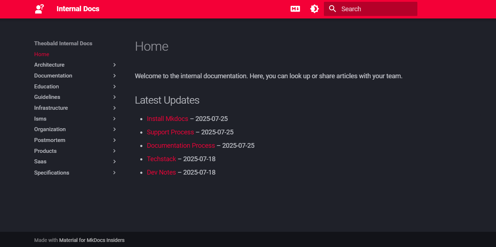

When maintaining documentation with MkDocs, it can be helpful to give readers a quick overview of what’s been updated recently. There are a few ways to convey this kind of information, like:
- Adding revision dates to the bottom of individual pages using the [`mkdocs-git-revision-date-localized-plugin`](https://timvink.github.io/mkdocs-git-revision-date-localized-plugin/)
- Displaying a page status (e.g. "draft", "new", "updated") next to the page title in the navigation via the [`status` feature of the Material theme](https://squidfunk.github.io/mkdocs-material/reference/#setting-the-page-status)
- Adding a table containing git commit information using the [mkdocs-git-latest-changes-plugin](https://github.com/tombreit/mkdocs-git-latest-changes-plugin).

However, both of these methods require the user to either open the page or scroll through the navigation to discover what's new.
That’s why I wanted to go a step further and display a list of the five most recently modified pages directly on my landing page—automatically generated during the build process. This is what I was going for:



I explored two different approaches to accomplish this:
- Using [`mkdocs-macros-plugin`](https://mkdocs-macros-plugin.readthedocs.io/en/latest/)
- Using [`mkdocs-gen-files`](https://oprypin.github.io/mkdocs-gen-files/) (the method I personally prefer)

## Approach 1: Using `mkdocs-macros-plugin`

The `mkdocs-macros-plugin` lets you write Python functions and call them via Jinja2-style macros directly in your Markdown. 

Setup:
1. Install the plugin:
```
pip install mkdocs-macros-plugin
```
2. Enable it in `mkdocs.yml`:
```yaml
plugins:  
  - macros
```
3. Create a file `Main.py` in your project root directory:
```python
from pathlib import Path
import subprocess
from datetime import datetime
import yaml


def define_env(env):
    @env.macro
    def recent_updates(n=10):
        docs_dir = Path("docs")
        entries = []
  
        for md_file in docs_dir.rglob("*.md"):
            if "index.md" in str(md_file) or "_includes" in str(md_file):
                continue

            # Get Git modified timestamp
            result = subprocess.run(
                ["git", "log", "-1", "--format=%ct", str(md_file)],
                stdout=subprocess.PIPE,
                stderr=subprocess.DEVNULL,
                text=True
            )
            timestamp = result.stdout.strip()
            if not timestamp:
                continue
            dt = datetime.fromtimestamp(int(timestamp))

            # Try to read title
            title = md_file.stem  # fallback
            try:
                with md_file.open("r", encoding="utf-8") as f:
                    lines = f.readlines()

                    # Check for YAML frontmatter
                    if lines[0].strip() == "---":
                        end = lines[1:].index("---\n") + 1
                        frontmatter = "".join(lines[1:end])
                        data = yaml.safe_load(frontmatter)
                        if isinstance(data, dict) and "title" in data:
                            title = str(data["title"])
                        lines = lines[end+1:]  # continue with rest

                    # Look for H1 heading
                    for line in lines:
                        if line.strip().startswith("# "):
                            title = line.strip().removeprefix("# ").strip()
                            break

            except Exception:
                pass

            entries.append((dt, md_file.relative_to(docs_dir), title))
  
        entries.sort(reverse=True)
        return entries[:n]
```
3. Add this to your `index.md` (or any other page) to show the updates:
```markdown
  ## Latest Updates
  
  
  - [{{ title }}]({{ path }}) – {{ dt.strftime('%Y-%m-%d') }}
  
```

### Limitations

A known limitation of the macros plugin is that it parses **all** `` and `{{ ... }}` blocks as Jinja. This can interfere with documentation that needs to show template code as literal examples.

That’s why I eventually switched to a generation-based approach.

## Approach 2: Using `mkdocs-gen-files`

The [`mkdocs-gen-files`](https://oprypin.github.io/mkdocs-gen-files/) plugin allows you to dynamically generate Markdown content at build time. You can generate a file that contains the recently updated pages and inject it using [`Snippets` markdown extension](https://facelessuser.github.io/pymdown-extensions/extensions/snippets/).

Setup:
1. Install the plugin:
```
pip install mkdocs-gen-files
```
2. Enable it in `mkdocs.yml`:
``` yaml
plugins:
  - gen-files:
      scripts:
        - latest-updates.py
```
2. Create a script called `recent_updates.py` in your root directory:
```python
import subprocess
from pathlib import Path
from datetime import datetime

import mkdocs_gen_files

DOCS_DIR = Path("docs")

# This is the number of list items
NUM_ENTRIES = 5 

# This is where the content will be written to
SNIPPET_PATH = f"index.md"

def get_git_modified_time(filepath: Path) -> datetime | None:
    result = subprocess.run(
        ["git", "log", "-1", "--format=%ct", str(filepath)],
        stdout=subprocess.PIPE,
        stderr=subprocess.DEVNULL,
        text=True,
    )
    timestamp = result.stdout.strip()
    return datetime.fromtimestamp(int(timestamp)) if timestamp else None

# Collect all .md files and their last Git-modified time
entries = []

for file_path in DOCS_DIR.rglob("*.md"):
    if "index.md" in str(file_path) or "_includes" in str(file_path):
        continue  # Skip landing page/snippets
    dt = get_git_modified_time(file_path)
    if dt:
        entries.append((dt, file_path.relative_to(DOCS_DIR)))

# Sort by date and take the top N
entries.sort(reverse=True)
recent = entries[:NUM_ENTRIES]
  
# Write to file using mkdocs_gen_files
with mkdocs_gen_files.open(SNIPPET_PATH, "w") as f:

    print("""---
title: " Home"
hide:
  - toc
---
  
Welcome to the internal documentation. Here, you can look up or share articles with your team.

## Latest Updates

""", file=f)

    for dt, path in recent:
        url = str(path).replace(" ", "%20")
        name = path.stem.replace("-", " ").title()
        print(f"- [{name}]({url}) – {dt.strftime('%Y-%m-%d')}", file=f)
```
    
## Final Thoughts  
If you just want to inject dynamic lists and simple logic into pages, the **macros plugin** is quick and easy. But for more robust and templating-safe solutions, I recommend using the `mkdocs-gen-files` plugin to pre-generate content.  This workflow lets you automate useful features like "Recently Updated Pages" while keeping your Markdown clean and templating issues to a minimum.  