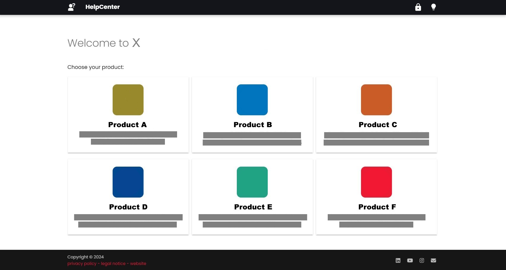

In this post I'd like to show you how I set up multiple product documentations in a single gitHub repository.
This post covers the following points:
- Set up a single repository that contains multiple product documentations
- Set up an assets folder that is available for all products (includes images, files and text snippets)
- Extra: use variables to switch between assets depending on the product
- Extra: create a central batch file that can serve single or multiple product documentations simultaneuously

Note that the approach I use in this post is just one way of setting up a multiple projects repository.
There are alternative approaches available.

## About this Use Case
Our company offers multiple products that share a lot of similar software modules.
Because of their similarity, it is necessary (or at least advisable) to have multiple shared assets to reduce maintenance.
These assets include images, files and text snippets that need to be available in all products.
At the same time, each product should be equipped with their own separate search functionality and their own (product) color scheme.

Additionally, we also wanted to provide a landing page where users can choose their product, see screenshot below:




## Setup of Landing Page and Subprojects

For the landing page of the documentation, set up a simple mkdocs documentation project, see [Getting Started with MkDocs](https://www.mkdocs.org/getting-started/). 
To manage subprojects within your repository, you can use the [`projects` plugin](https://squidfunk.github.io/mkdocs-material/plugins/projects/) that is part of the Material theme's [sponsorship program](https://squidfunk.github.io/mkdocs-material/insiders/).
Alternatively, you can use the [Monorepo plugin](https://github.com/backstage/mkdocs-monorepo-plugin).

When using the projects plugin, activate the plugin in the mkdocs.yml file of your main documentation and define a folder that contains your subprojects / product documentations. Example:
```yaml
plugins:
  - projects:
      projects_dir: projects
```

Make sure to actually create the folder in your repository. 
Within that folder, create an mkdocs project for every product documentation you want to host in your repository. 
The folder structure should look something like this:



To build documentation from multiple repos into one site, refer to the [Multirepo plugin](https://github.com/jdoiro3/mkdocs-multirepo-plugin).



## Setup Shared Assets

One way to store assets like images and files is to have a dedicated folder in the `/docs` directory of an mkdocs project.
In my case, I use a folder `shared-assets` in the root directory of the repository to store common assets that are shared in all subprojects.
To make the `shared-assets` folder vailable in the `/docs` folder of my subprojects, I use symbolic links.
A symbolic link is a file that points to a target file or a target directory and that exists independently of its target.
If a symbolic link is deleted, its target remains unaffected.

An alternative approach to ahre assets would be to use git [submodules](https://git-scm.com/book/en/v2/Git-Tools-Submodules).

### Create Symlinks in Windows

 
To use symlinks on Windows, you need to [activate the Developer Mode](https://learn.microsoft.com/en-us/windows/apps/get-started/enable-your-device-for-development) in your Windows Settings.


1. Open the Windows command prompt as an administrator.
2. Navigate to one of the product documentation folders. Example:<br>
`C:\Source\docu-project.github.io\projects\product-a\docs\`
3. Enter the `mklink /D` command to point to a target folder. Example:<br>
`mklink /D name_of_new_symlink relative_path_to_target_folder`<br>

4. Check if the symlink is set correctly. When double-clickin a symlink in the Windows Explorer, the symlink folder opens and the files from the target folder are available.

Repeat the steps for all subprojects.
For more information on how to set up symlinks in Windows, see [Complete Guide to Symbolic Links](https://www.howtogeek.com/16226/complete-guide-to-symbolic-links-symlinks-on-windows-or-linux/).



Broken symlinks are displayed as a single file instead of a folder. Delete these files, before creating new local symlinks.
Also note that symlinked images and files cause long processing times when using the [`optimize` plugin](https://squidfunk.github.io/mkdocs-material/plugins/optimize/).



### Setup Reusable Text Snippets

I use the [`macros` plugin](https://mkdocs-macros-plugin.readthedocs.io/en/stable/macros/) to use text snippets (and [variables](#extra-variables)) in my markdown files.
Alternatively, you can use the [`snippets` plugin](https://facelessuser.github.io/pymdown-extensions/extensions/snippets/).

When using the macros plugin, you need to define the directory that contains the text snippets in the mkdocs.yml files of your product documentations. Example: 

```yaml
plugins:
  - search
  - macros:
      include_dir: docs/shared-assets/include
```

You can reference files in this directory using the following syntax:
```markdown

```

For more information, see [Changing the directory of the includes](https://mkdocs-macros-plugin.readthedocs.io/en/stable/advanced/#changing-the-directory-of-the-includes)


## Final Folder Structure

The following treeview illustrates the general folder structure of my repository. 
The `shared-assets` folder (and the `overrides/.icons/` folder) in the root directory is the target of multiple symlinks.

``` bash
.
├───.cache
├───.github
│   └───workflows #contains the GitHub workflow for publishing
├───docs
│   ├───assets #contains images and stylesheets for the landing page
│   │   ├───images #contains images
│   │   ├───javascripts #contains custom functions
│   │   └───stylesheets #contains custom styles
│   └───index.md #landing page
├───mkdocs.yml #configuration file for the landing page
├───shared-assets #contains common assets that are shared througout all products
│   ├───files #contains downloadable files
│   ├───images #contains images for all products
│   └───includes #contains .md files that can be referenced in all products
├───overrides #contains custom designs for the landing page, e.g., 404 page
│   ├───.icons #contains custom icons
│   └───partials #contains extended theme elements
├───projects #contains content of product documentation
│   └───[product-name]
│       ├───docs #contains the content of the product documentation
│       │   ├───shared-assets #symlink to the shared-assets folder in the root directory
│       │   │    ├───files #contains downloadable files
│       │   │    ├───images #contains images that are available in all products
│       │   │    └───includes #contains .md files that can be referenced in all products
│       │   ├───assets #contains functions and stylesheets for the product documentation
│       │   │   ├───javascripts #contains custom functions for the product documentation
│       │   │   └───stylesheets #contains custom styles for the product documentation
│       │   └───index.md #landing page of the product documentation
│       ├───mkdocs.yml #configuration file for the product documentation
│       ├───overrides #contains custom designs, e.g. banner & announcements
│       │   ├───.icons #symlink to parent folder
│       │   └───partials #contains extended theme elements
│       └───site  #contains the built html pages of the product
└───site #contains the built html pages of all products
```

## Extra: Variables

The [`macros` plugin](https://mkdocs-macros-plugin.readthedocs.io/en/stable/macros/) does not only enable you to use reusable text snippets in your product documentations, but also lets you define variables in the `extra` namespace of your mkdocs.yml files.

How to define and use variables:
1. Open the mkdocs.yml file of a product documentation.
2. Define variables in the `extra`namespace:
    ```yaml
    extra:
      variable-name: value
      productName: Product A
      installationDir: C:\Program Files\Product-A
      imagePrefix: product-a
    ```
3. Use the variable in reusable or regular text using the following syntax:
    ```
    {{ variable-name }}
    ```
    Example: 
    ```
    {{ productName }} is installed in the following default directory: {{ installationDir }}.
    ```

When serving or building the project, the values defined in the corresponding mkdocs.yml file are applied in place of the variable name.

Using variables in combination with reusable text snippets is not only a great way to provide dynamic text, they can also be used to switch between assets, e.g., when product documentations have the same text, but use different screenshots of the UI.
The following text snippet adds an image (product-a_define-xyz.png, product-b_define-xyz.png or product-c_define-xyz.png) based on a variable:

```markdown
The screenshot below shows XYZ of {{ productName }}.
{:class="img-responsive"}
```

**Tip:** You can also build more complex conditions in your text snippets using html and metadata from the front matter of your markdown files.
Example:
``` html

This content is only displayed on pages that use the following meta tag in the front matter.
`module: table`

This content is only displayed on pages that do **not** use the meta tag `table` in the front matter.

```

## Extra: Serve Local Previews

There are multiple ways to serve a local preview of your product documentations:
- serving a preview in the root directory of the repository (`C:\Source\docu-project.github.io\`) serves **all** product documentations
- serving a preview in the root directory of a product (`C:\Source\docu-project.github.io\projects\product-a\`) serves a single product documentation

Depending on the number of documentations inside the repository, serving local previews can take some time.
The same can be said about navigating and serving multiple single product documentations.
That's why I added a short .bat script to the root directory of the repository that does the following:
- Prompts user to enter one or more product numbers (0 serves all documentations, 1 only serves product A, etc.)
- Prompts user to enter optional arguments (press enter to ignore this step)
- Opens a new console for every product (to observe warnings, etc.)
- Opens each preview in a new browser tab using different ports (e.g., product A uses localhost:8001, product B uses localhost:8002, etc.)

To use the script, simply replace the paths of the product documentations with your actual project paths.

```bash
@echo off
setlocal enabledelayedexpansion

echo Enter numbers between 0 and 3 to serve local previews. Separate multiple numbers with spaces:
echo 0 - Serve all docs
echo 1 - Product A
echo 2 - Product B
echo 3 - Product C
set /p numbers=

echo Enter optional arguments for mkdocs serve command. Leave empty for none:
echo dirty - only re-build files that have changed
echo help - show all input options
echo quiet - silence warnings
echo strict - abort the build on any warnings
echo watch PATH - a directory or file to watch for live reloading (can be supplied multiple times)
set /p optional_args=

for %%i in (%numbers%) do (
    set folder=
    set port=
	set product=
    if %%i==0 (
        set "folder=C:\Source\docu-project.github.io\"
        set "port=8000"
		set "product=Serve all docs"
    )
    if %%i==1 (
        set "folder=C:\Source\docu-project.github.io\projects\product-a\"
        set "port=8001"
		set "product=Product A"
    )
    if %%i==2 (
        set "folder=C:\Source\docu-project.github.io\projects\product-b\"
        set "port=8002"
		set "product=Product B"
    )
    if %%i==3 (
        set "folder=C:\Source\docu-project.github.io\projects\product-c\"
        set "port=8003"
		set "product=Product C"
    )
    if not defined folder (
        echo Invalid input for website number %%i
    ) else (
        if "!optional_args!"=="" (
            start "!product!" cmd /c "cd /d !folder! && mkdocs serve -a localhost:!port!" && start "" "http://localhost:!port!"
        ) else (
            start "!product!" cmd /c "cd /d !folder! && mkdocs serve -a localhost:!port! --!optional_args!" && start "" "http://localhost:!port!"
        )
	)
)
pause
```
