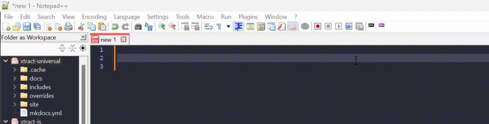
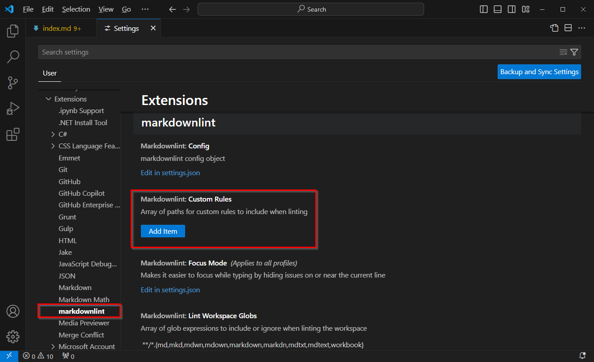
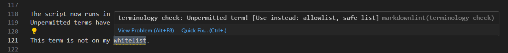
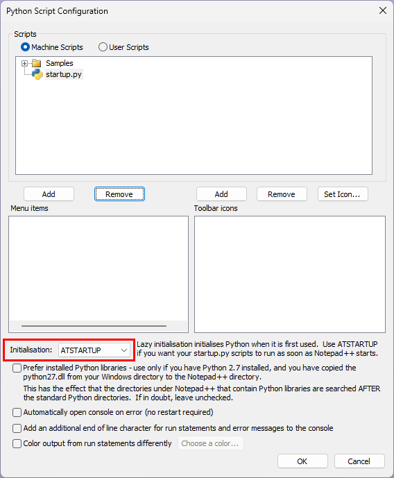

When writing documentation in a docs-as-code approach, you're probably using editors like [Visual Studio Code](https://code.visualstudio.com/) or [Notepad++](https://notepad-plus-plus.org/). Personally, I use both of them.
But one thing that I feel is missing in these editors are options to check my terminology.
In this post I'll show you how to set up a script that runs in the background of these editors to check your text against a simple termbase in realtime.

### About this Use Case

While Visual Studio Code offers some options to check your content against certain rules using the [Markdownlint](https://marketplace.visualstudio.com/items?itemName=DavidAnson.vscode-markdownlint) plugin, I couldn't find many options for Notepad++ aside from a simple [spell check](https://community.notepad-plus-plus.org/topic/17416/spell-check).

I hit my breaking point a few weeks ago, when I was musing over how to correctly word something for the trillionth time. Is it "drop down list", "drop-down list", "dropdown list", "dropdown menu" or any other variation of it? I had to look it up in our termbase - a simple Word document located on our server that contains a table of terms and their (unpermitted) alternatives. This Word document dictates which terms we use in the documentation to keep everything consistent. The correct variant turned out to be "dropdown list". But how much time could I have saved if my editor had just pointed me to the "correct" term.

So today we're equipping Visual Studio Code and Notepad++ with a script that checks text against a termbase in realtime.
The script will do the following:

- Whenever I modify a text in the editor, the script scans the text.
- The script compares the text against a list of unpermitted terms.
- If the script finds a match, the term is highlighted in the editor.
- When the user marks the term, the editor displays a list of permitted alternatives.

Example:



### Prerequisites for the Termbase

As the script will check for unpermitted terms, it requires a list of unpermitted terms and their permitted alternatives.
Each unpermitted term must be mapped to its alternative(s).<br>
As the Word document we use as our termbase is not suited for these automated checks, I got rid of it completely.
Instead I collected all terms in a .json file with the following format:

```json
"unpermitted": ["permitted_alternative_1", "permitted_alternative_2"],
```

Example:

```json
{
    "whitelist": ["allowlist", "safe list"],
    "blacklist": ["denylist", "blocklist"],
    "master": ["main", "primary"],
    "slave": ["secondary", "replica"],
    "dummy": ["sample", "placeholder"],
    "manpower": ["workforce", "personnel"],
    "sanity check": ["validation check", "integrity check"],
    "guys": ["folks", "everyone", "team"]
}
```

Alternatively, you can also use .yaml files.


If you're working in a team of writers, make sure that the file is accessible to all team members.


### Terminology Checks in VS Code

Follow the steps below to make Visual Studio Code check your terminology in realtime:

1. If you write documentation in Markdown, install the [Markdownlint](https://marketplace.visualstudio.com/items?itemName=DavidAnson.vscode-markdownlint) extension. Alternatively, install the [ESLint](https://marketplace.visualstudio.com/items?itemName=dbaeumer.vscode-eslint) extension. These extensions allow you to include a library of rules to encourage standards and consistency. The depicted example uses Markdownlint.
2. To add a custom rule, create a new java script file, e.g., in the installation directory of Visual Studio Code: <br>
`C:\Users\AppData\Local\Programs\Microsoft VS Code\custom-rules\term-checker.js`.
3. Copy the following code into the java script file:

    ```java
    const fs = require('fs');
    const path = require('path');

    // Load the JSON file with unpermitted terms
    const termsPath = path.resolve(__dirname, 'termbase.json');
    const terms = JSON.parse(fs.readFileSync(termsPath, 'utf8'));

    module.exports = {
        names: ["terminology check"],
        description: "Unpermitted term!",
        tags: ["terminology"],
        function: function rule(params, onError) {
            // Iterate through each line in the Markdown document
            params.tokens.forEach((token) => {
                if (token.type === "paragraph_open") {
                    const lineNumber = token.lineNumber;
                    const lineText = params.lines[lineNumber - 1];

                    // Check for unpermitted terms
                    Object.entries(terms).forEach(([unpermittedTerm, alternatives]) => {
                        const regex = new RegExp(`\\b${unpermittedTerm}\\b`, 'gi');
                        let match;
                        while ((match = regex.exec(lineText)) !== null) {
                            onError({
                                lineNumber,
                                detail: `Use instead: ${alternatives.join(", ")}`,
                                range: [match.index + 1, unpermittedTerm.length],
                            });
                        }
                    });
                }
            });
        }
    };
    ```

4. Replace `termbase.json` with the path to your list of terms.
5. Save the file and open Visual Studio Code.
6. Navigate to **File > Preferences > Settings** and scroll down to the settings of your lint extension.<br>

7. Enter the path to the java script of the new custom rule, e.g., `C:\Users\AppData\Local\Programs\Microsoft VS Code\custom-rules\term-checker.js`
8. Open a markdown file in Visual Studio Code and test the rule.

The script now runs in the background and checks the current document against the termbase.json file for unpermitted terms.
Unpermitted terms have a wavy green underline. Hover over the word to display alternative terms.
Example:




Note that most [rules](https://marketplace.visualstudio.com/items?itemName=DavidAnson.vscode-markdownlint#rules) of the Markdownlint extension are enabled by default. They cause similar highlights in your markdown text. You can disable rules via **File > Preferences > Settings > Extensions > markdownlint > Edit in settings.json**. In the settings.json file, add the rules you want to diable. <br>
Example:

``` json
"markdownlint.config": {
    "MD013": false,   // Disables line-length rule
    "MD033": false,   // Disables inline HTML rule
    "MD041": false,   // Disables first-line header rule
    "MD007": { "indent": 4 }  // Configures unordered list indentation to 4 spaces
}
```



### Terminology Checks in Notepad++

Follow the steps below to add a python script to Notepad++ that checks your terminology in realtime:

1. Install the PythonScript plugin:<br>
a. Open Notepad++.<br>
b. Go to **Plugins > Plugins Admin**.<br>
c. Look up *PythonScript* and install it.
2. Restart Notepad++.
3. Open the following file with administrator rights: `C:\Program Files\Notepad++\plugins\PythonScript\scripts\startup.py`.
4. Paste the following code into the startup.py file.

    ```python
    import json
    import re
    from Npp import *

    # Load forbidden terms and their alternatives from the JSON file
    with open(r'termbase.json', 'r') as f:
        forbidden_terms = json.load(f)

    # Create a regex pattern for forbidden terms
    forbidden_pattern = re.compile(r'\b(' + '|'.join(re.escape(term) for term in forbidden_terms.keys()) + r')\b', re.IGNORECASE)

    # Function to highlight forbidden terms
    def highlight_forbidden_terms():
        # Setting up indicator style and color
        editor.indicSetStyle(0, INDICATORSTYLE.FULLBOX)  # Fullbox style for highlighting
        editor.indicSetFore(0, (255, 0, 0))  # Red color for forbidden terms

        text = editor.getText()

        # Search for forbidden terms in the text
        for match in forbidden_pattern.finditer(text):
            start_pos = match.start()
            end_pos = match.end()
            editor.setIndicatorCurrent(0)
            editor.indicatorFillRange(start_pos, end_pos - start_pos)  # Highlight the forbidden term

    # Function to suggest alternatives if a forbidden term is selected
    def suggest_alternatives_on_selection():
        # Get the start and end positions of the selection
        selection_start = editor.getSelectionStart()
        selection_end = editor.getSelectionEnd()

        # Ensure the selection is non-empty
        if selection_start == selection_end:
            return

        # Get the selected word
        selected_word = editor.getTextRange(selection_start, selection_end).lower()

        # Check if the selected word is a forbidden term
        if selected_word in forbidden_terms:
            # Get the list of alternatives
            alternatives = forbidden_terms[selected_word]

            # Replace spaces in multi-word alternatives with underscores
            alternatives_with_underscores = [alt.replace(' ', '_') for alt in alternatives]

            # Show a dropdown with alternatives, using a space as the separator
            editor.autoCShow(0, ' '.join(alternatives_with_underscores))

    # Event handler for text modification
    def on_text_modified(args):
        # Highlight forbidden terms whenever the text is modified
        highlight_forbidden_terms()

    # Set up event listener for text modification
    editor.callback(on_text_modified, [SCINTILLANOTIFICATION.MODIFIED])

    # Event handler for selection changes
    def on_selection_changed(args):
        suggest_alternatives_on_selection()

    # Set up event listener for selection changes to trigger suggestions
    editor.callback(on_selection_changed, [SCINTILLANOTIFICATION.UPDATEUI])

    # Initial highlighting and setup
    highlight_forbidden_terms()
    ```

5. Replace `termbase.json` with the path to your list of terms.
6. Save the file and open Notepad++.
7. Navigate to **Plugin > Python Script > Configuration...**.
8. In the section *Scripts*, select **Machine Scripts**. The startup.py file should be listed in the file tree menu.
9. Select *ATSTARTUP* as the initialization method.<br>

10. Click **[OK]** and restart Notepad++.

The script now runs in the background and checks the current document against the termbase.json file for unpermitted terms.
Unpermitted terms are highlighted in red. Mark the complete word to display alternative terms.


Due to restrictions, a term that consists of multiple words is divided by a '_' character instead of an empty space. Example: "dropdown list" is displayed as "dropdown_list".

